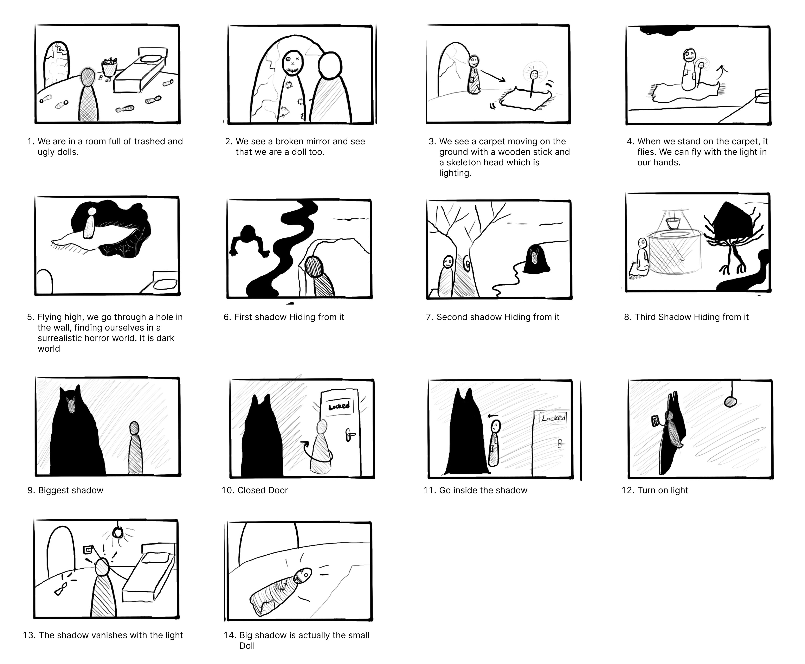

## Plan for storyboard 

- We are in a room full of trashed and ugly dolls.
- We see a broken mirror and see that we are a doll too. 
- We see a carpet moving on the ground with a wooden stick and a skeleton head which is lighting. 
- When we stand on the carpet, it flies. We can fly with the light in our hands. 
- Flying high, we go through a hole in the wall, finding ourselves in a surrealistic horror world. It is dark world 
- First shadow Hiding from it
- Second shadow Hiding from it
- Third Shadow Hiding from it
- Biggest shadow
- Closed Door
- Turn on light
- Small Dolls

## Platform for maquette

- We decided to make the platform round in order to beat the "loop" effect. Having bought the base in the wood atelier, we cut out the shape in the atelier with a cutting machine

## Storyboard

-  Thanks to the discussion and corrections from Sabrina, we have finished our storyboard, which will be our basis in future work.

