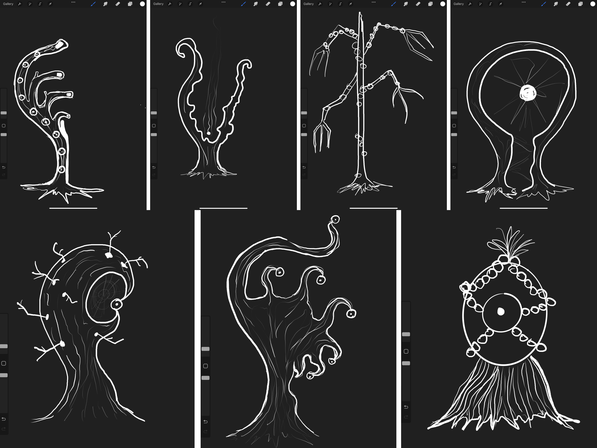

## 2023-05-18  

- On this day we began by developing sketches of our main elements - the trees and the main character - the doll. After that we proceeded to build the skeleton of the doll from paper and papier mache. We also discussed the possibility of movement in our world, but at that time we did not come to a consensus, because we do not fully understand the mechanism of the vr

