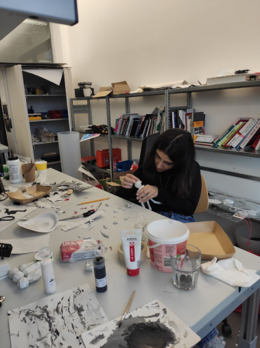
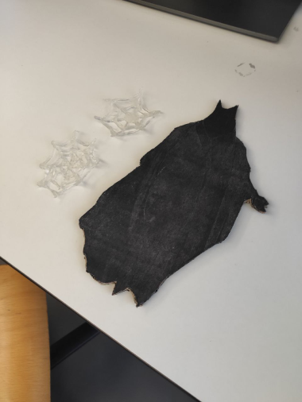
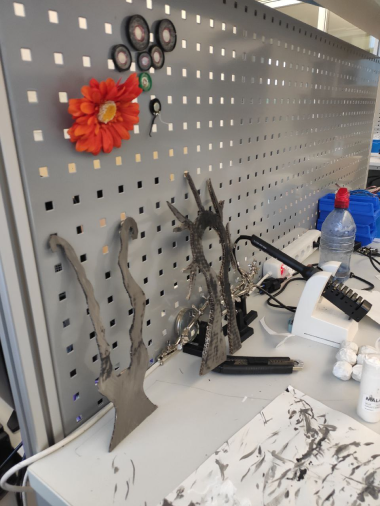
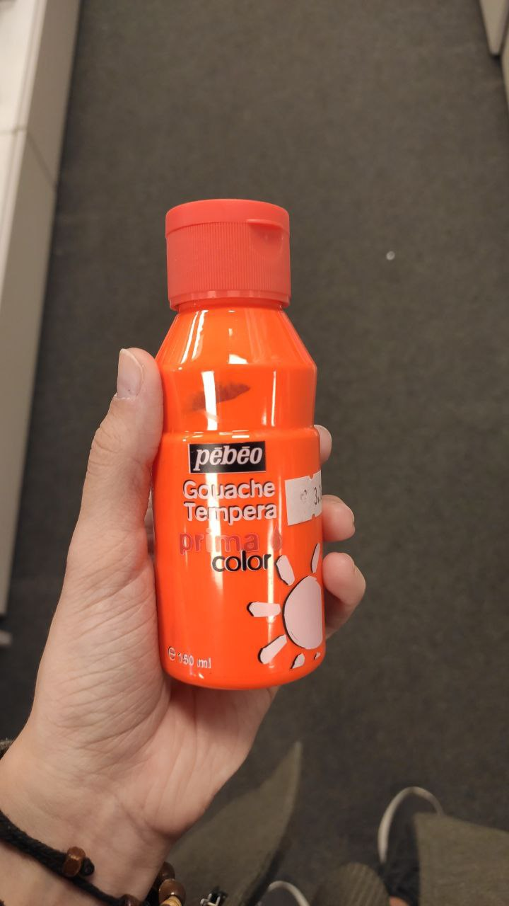
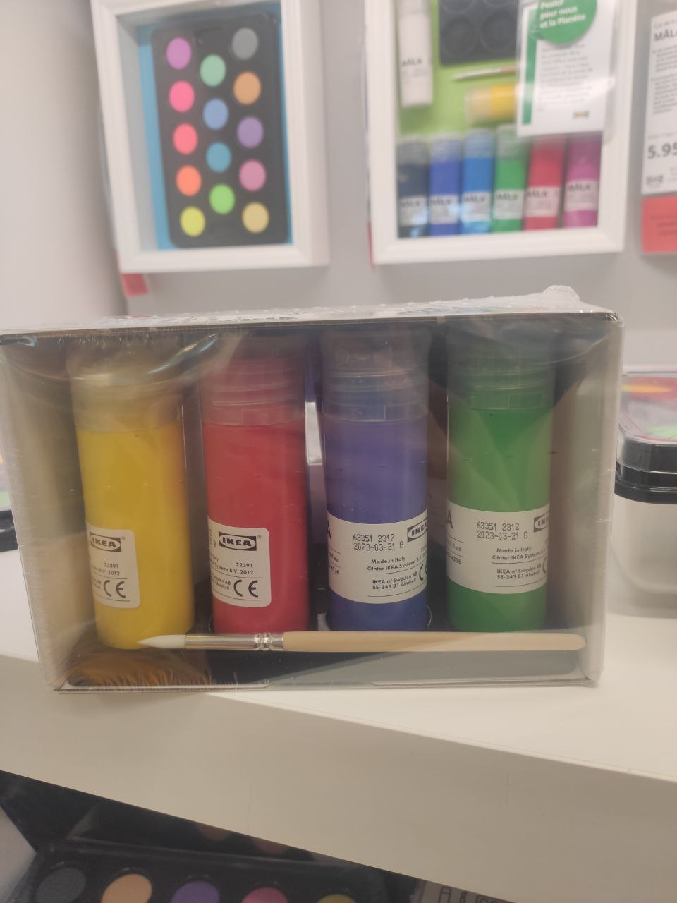
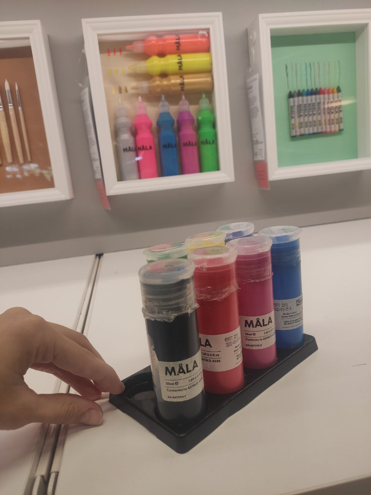

## 2023-05-19

- In the morning we split up, Nargess continued working on the doll and Maria went to get materials - paints and clay. In the afternoon we continued working on the dolls and completed the trees, as well as finished working on the large shadow

