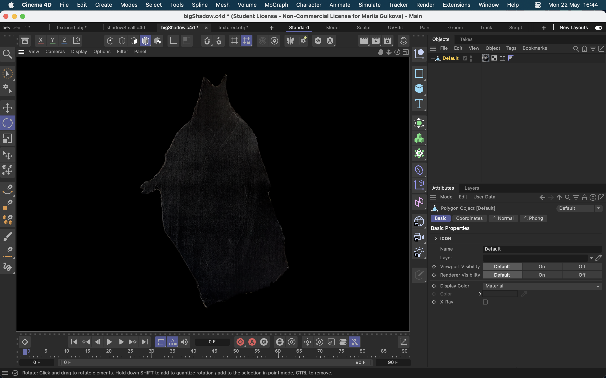
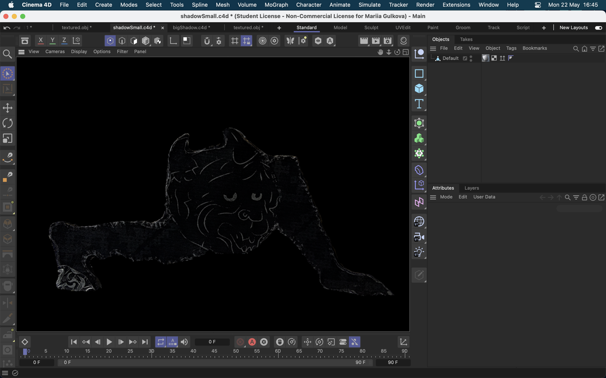

## 2023-05-22

- On this day, we scanned our shadows and cleaned them in Cinema4d in order to start working on the rigging and to use them in unity. We prepared dead dolls for scanning, made additional trees, and also continued to work on the main doll. We plan to paint the main objects in substance and check how they fit aesthetically in the unity. In this way, we will be sure of the color scheme and will be able to paint the real models with more confidence for the maquette.

