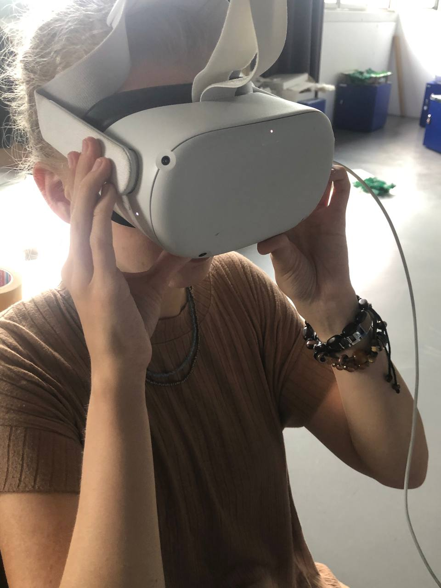

- Hello!
On 23 May, We scanned the small shadow and the dead puppet. We cleaned the shadows in C4d. We tried oculus for the first time (Cool). We imported some objects in unity and connected our oculus headset to see the cube world in the application. pretty cool, right?

On 24 May, we rescanned our shadows with camera, scanned our main puppet and the tree. We added some of them in C4D, cleaned them and reduced the polygons. What else? hmmm... Oh, yes. We started rigging our small shadow. We put our objects in the unity and saw them in the oculus headset. It was so amazing.

