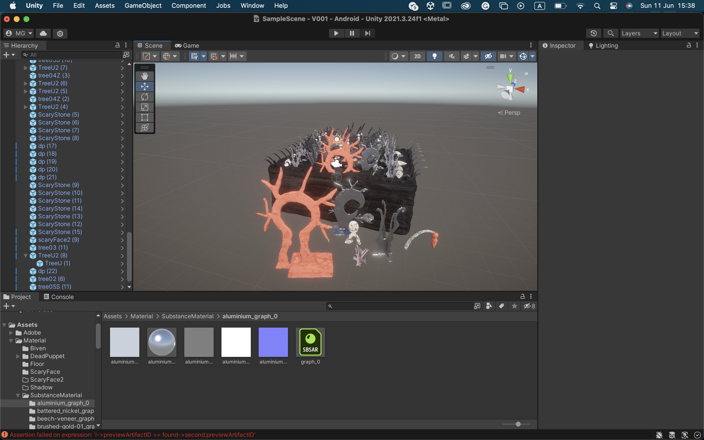
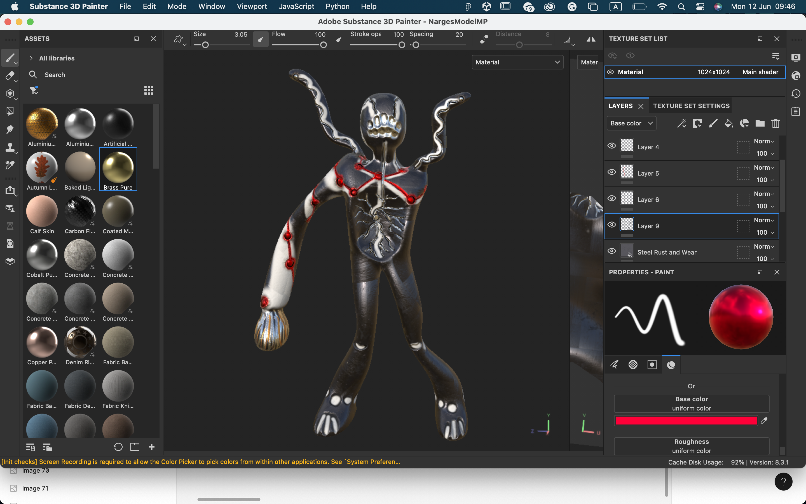

## 2023-06-09-11

- finished the scene

- created cute texture for objects

- created skybox

- created a new shape of main puppet for rigging (scanned doesnt work)

- finished main puppet texture

-  started post processing

- created ambient light, which changing with lighting each object

- created mirror state code

- wrote script for changing texture

- start working on: put main character as VR, hand instead of VR

- start working on mirror came after ambient light 

- did a testing with people 

- start working on transfering rigging shadow model from blender to unity

