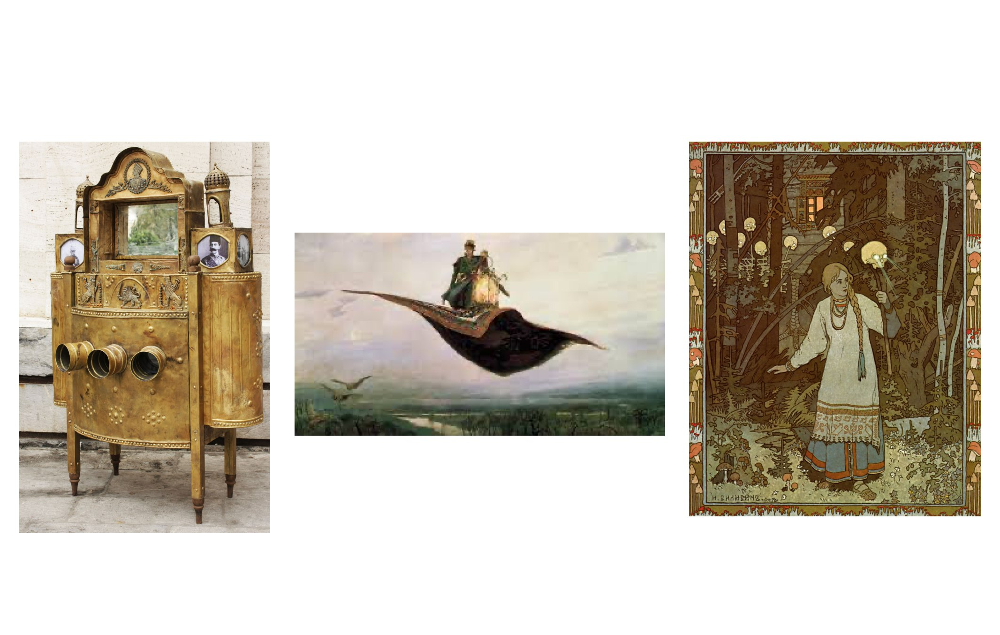

## Pitch 2023-05-09

Our starting point in this project was to collect different ideas and visuals, and we ended up with several topics as a iranian and ukrainian folklors, and how we can modernize them in our iteration and maquette. We found a refrence for our main object which is mentioned below. The story is about travelling in Ukrain and Iran's culture by means of a flying carpet, giving a chance to people exploring different worlds. The maquette (our world) is inspired by an Iranian object (city of foreigners), which is a box with holes. Each hole has a new world inside that you can go through and explore new horror surrealistic worlds. 

### Key words

Travelling, worlds, carpet, halls,