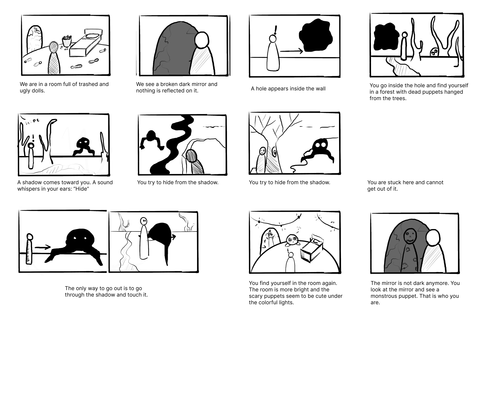

### Project File

### Shades of Metamorphosis

Mariia GULKOVA, Narges Hamidi Madani
Master Media Design, HEAD–Genève

### Pitch

You open your eyes in a room with some scary trashed puppets. There is a dark broken mirror on the wall. A hole appears inside the wall. You go inside the hole and find yourself in a forest with dead puppets hanged around. A shadow comes toward you. A sound whispers in your ears: “Hide”. You try to hide while you see scary trees and monstrous-faced stones on the ground. You are stuck here and cannot get out of it. The only way to go out is to go through the shadow. You do it and you find yourself in the room again. The room is more bright and the scary puppets seem to be cute under the colored lights. The mirror is not dark anymore. You look at the mirror and see a monstrous puppet.

### Synopsis

### Visual Interaction Loop

Our main interaction at the moment is contact with the shadow by touching. The second interaction is hiding from the shadow and avoiding touching. Touching the Shadow, you see yourself where you startedin the room again.

### POV

POV == Points of view. Describe all the POVs where the player can stand/float/be in the scene. Who are you, where are you, what do you see?
We are a monstrous puppet not aware of who we are until the end of the experience.
- At first,  we are in a dark room full of dead puppets and a scary shadow.(The first sparkles of fear begins)
- Then, we walk inside the world of shadows (The world that gives us the chance to face our fears), 
- By Touching the shadow, we see ourself again in the same room. ( changing to a beautiful place although everything is the same as before)

### Assets

#### Models
- Main Puppet
- Dead puppets
- Shadow
- Mirror
- bed
- trees
- monstrous stones
- Well
- Scary house tree

#### Gestures
- Take a lamp (lantern) in our hand
- Touching the Shadow

#### Sounds
- Voice of a person in the ear (Hide)
- footstep sounds
- the sounds of the dying
- wind sounds
- foliage sounds
- creak

### State Machines

#### Main puppet
- Moving to a Point
- Hiding: Sitting and Bending behind something
- Taking a lamp
#### Shadows
- Appear > Transparent at first
- waving
#### Mirror
- Not reflecting anything
- Reflect the monstrous puppet

#### Main puppet
- Moving to a Point
- Hiding: Sitting and Bending behind something
- Taking a lamp

#### Shadows
- Appear > Transparent at first
- waving

#### Mirror
- Not reflecting anything
- Reflect the monstrous puppet
